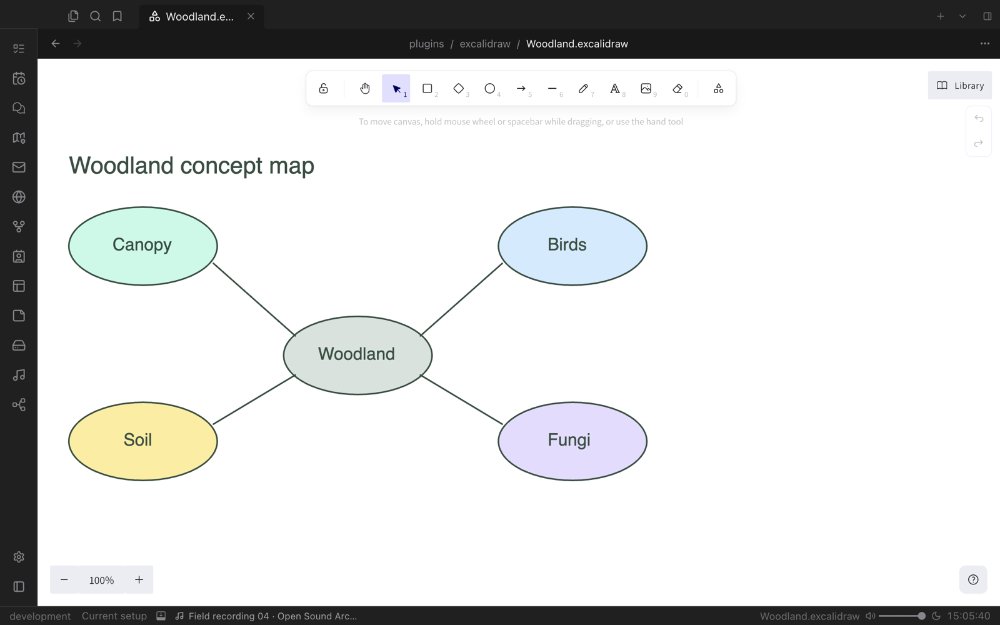
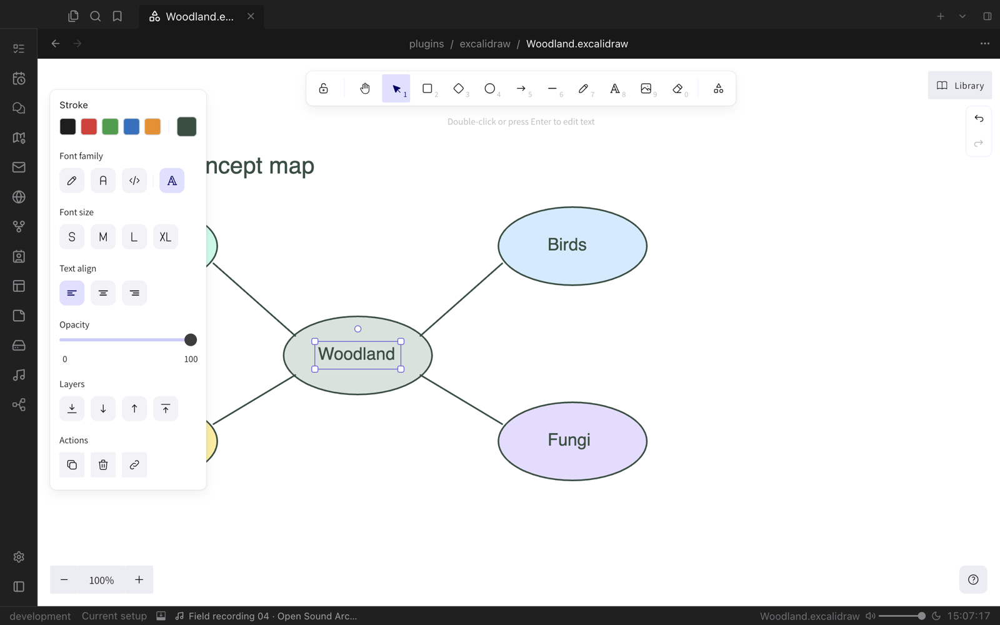

# Excalidraw

A hand-drawn style whiteboard for your vault. Sketch diagrams, concept maps and flows on an infinite canvas, link shapes to notes and embed drawings anywhere.

## Draw freely

Shapes, arrows, lines, freehand strokes, text and images, all on an infinite canvas with undo and redo. The tool strip stays out of the way, keyboard shortcuts work as expected, and your library keeps reusable elements one click away.

Select any element to change its colour, font, size, alignment, opacity or layer.

## Part of your notes

- Link elements to notes with `[[wikilinks]]`.
- Embed a drawing in a note with an `excalidraw` code block and choose its height.
- Drawings appear in Properties, bookmarks and search like any other file.

## Open formats

`.excalidraw`, `.excalidraw.json` and editable `.excalidraw.svg` files all open in the editor and save back to their original format. SVG drawings stay visible as images everywhere while remaining fully editable in Valley.
